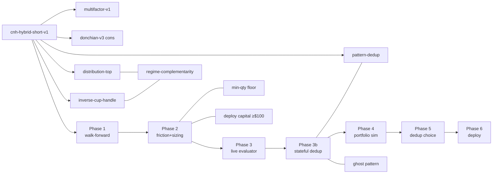

# snapback-btc — HYBRID short knowledge graph

Self-contained Obsidian vault documenting the `cnh-hybrid-short-v1` strategy
work (2026-05-25 → 2026-05-26). Open this folder as a vault in Obsidian:
`File → Open Folder as Vault…` then point at `snapback-btc/obsidian/`.

Then `Cmd/Ctrl + G` to open the graph view.

## Entry points

- [[HYBRID-short-strategy]] — root node, the strategy itself
- [[strategies/multifactor-v1]], [[strategies/donchian-v3]] — the other two legs
- [[phases/phase-6-deploy-plumbing]] — what's still pending

## Map of content

## Tag legend (for graph-view color coding)

| Tag | Used by | Meaning |
|---|---|---|
| `#strategy` | strategies/* | A deployable strategy (deployed or candidate) |
| `#detector` | detectors/* | A signal-generation primitive |
| `#phase` | phases/* | A validation phase in the pipeline |
| `#decision` | decisions/* | An explicit pick that's locked |
| `#concept` | concepts/* | A reusable idea / mechanism / constraint |
| `#artifact` | artifacts/* | A produced output (file, report, data) |
| `#failed` | applied to strategies/decisions that were rejected — useful for "what we tried" filtering |

## Reading order (first-time)

1. [[HYBRID-short-strategy]] — what the strategy is
2. [[detectors/distribution-top]] + [[detectors/inverse-cup-handle]] — what it detects
3. [[phases/phase-1-walk-forward]] — does it work on OOS? Yes
4. [[phases/phase-2-friction-sizing]] — capital constraint discovered
5. [[concepts/min-qty-floor]] — why the capital constraint is structural
6. [[phases/phase-3-live-evaluator]] + [[phases/phase-3b-stateful-dedup]] — code wired
7. [[phases/phase-4-portfolio-sim]] — does it lift the combined portfolio? Yes
8. [[phases/phase-5-dedup-choice]] — final config locked
9. [[phases/phase-6-deploy-plumbing]] — what's pending when capital lands

## See also

- HTML report: `../reports/HYBRID_VS_ALL.html`
- Plan: `../HYBRID_SHORT_PLAN.md`
- Status: `../AFK_REPORT.md`
- Memory entries: `/Users/god/.claude/projects/-Users-god-Desktop-work/memory/snapback_hybrid_*.md`
